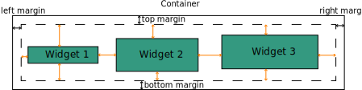

.. _uses-enaml:

Enaml
=====

.. include:: ../substitutions.sub

Enaml is a programming language and framework for creating professional-quality
user interfaces with minimal effort. It relies on Kiwi to layout widgets.

To implement its layout, Enaml uses a nestable model. Containers widgets
handle the constraints generation used to layout their children. Furthermore,
they pass to their their children a representation of the bounding box in
which they should live which allows the widgets to position themselves inside
their parent. Since each leaf component has a "preferred size", the system can
be solved from the bottom-up and set the size the parents based on the required
space of the children. If at a later time the parent is resized, this new input
can be used to solve the layout problem.

The following sections will describe in more details how the constraints are
generated and the preferred size estimated.

Widget variables
----------------

In Enaml, each widget that can be constrained defines a bunch of Kiwi
|Variable|: ``left``, ``top``, ``width`` and ``height``. In addition,
it provides easy access to combination of those: ``right``, ``bottom``,
``h_center``, ``v_center``. Those variables will be used to define the layout.

In addition, because each widget has a preferred size, it defines a set of
constraints related to that preferred size on which the user can act upon by
modifying their strength:
- hug_width: equivalent to (width == hint) | hug_width
- hug_height: equivalent to (height == hint) | hug_height
- resist_width: equivalent to (width >= hint) | resist_width
- resist_height: equivalent to (height >= hint) | resist_height
- limit_width: equivalent to (width <= hint) | limit_width
- limit_height: equivalent to (height <= hint) | limit_height

Finally, widget that can contain other widgets define a set of variables that
they expose to their children to allow to place themselves relative to their
parents. Those are: ``contents_left``, ``contents_top``, ``contents_width``,
``contents_height``, ``contents_right``, ``contents_bottom``,
``contents_h_center``, ``contents_v_center``. Those are usually not equivalent
to the non-prefixed variables (even-though they are related) because of the
container margins.

The base classes used a mixin to implement those behaviors are defined in:
https://github.com/nucleic/enaml/blob/master/enaml/layout/constrainable.py

Constraints definition
----------------------

Using the above variable, one can express any constraints. However, even for
simple vertical or horizontal boxes, the constraints to define, in
particular if one needs to introduce some spacing around the objects, become
quite painful to write by hand.

To make constraints definition easier, Enaml relies on helpers function and
classes. In the following, we will focus on how horizontal and vertical boxes
constraints are handled, by studing the following example in details:

Here we consider a container widget with three child widgets. The outer black
frame represents the limit of the container. The dashed frame represents the
contents visible to children when defining their constraint. The container uses
the margin definition to relate the outer left, top, width and height to their
'contents' equivalent.

The three widgets are arranged according to a horizontal box for which the
constraints are created using the `hbox` helper function which simply accepts
a list of widgets and spacers . To define the constraints from that list, Enaml
relies on the spacers represented here in orange. Each spacer has a
given size and a policy regarding that size (is it a minimum value, maximum,
how strongly to enforce that size). For each orientation, `hbox` add spacers so
that there is a spacer between each widget and between the widgets and the
parent boundaries. Some spacers can have a zero size, simply meaning that
widgets should be in contact.

When generating the constraints, `hbox` will be passed the container and use
the spacers to generate the constraints by simply glueing the anchors of
surrounding widgets. Each spacer can generate multiple constraints which gives
this process a lot of flexibility. Furthermore, those helpers define the same
variable as the widgets allowing for to position groups with respect to one
another.

.. note::

    In practice, `hbox` itself relies on some helpers but the above gives you
    the general idea.

For further details you can have a look at the source of the helpers described
in this section which can be found in the Enaml source:

- spacers: https://github.com/nucleic/enaml/blob/master/enaml/layout/spacers.py
- helpers:

    - https://github.com/nucleic/enaml/blob/master/enaml/layout/layout_helpers.py
    - https://github.com/nucleic/enaml/blob/master/enaml/layout/linear_box_helper.py
    - https://github.com/nucleic/enaml/blob/master/enaml/layout/sequence_helper.py

Setting up the solver
---------------------

So far we have only defined the constraints that represent the layout, we will
now turn to how Enaml pass those to the solver and how it handle updates and
solver resets.

By default, each container manages its own solver independently. This has
the advantage of keeping the system relatively smalls and hence allow for
faster updates. When setting up the solver, the container will add for each
widget a set of constraints reflecting the preference of the widget regarding
its size as reported by the widget, and add to those the constraints defining
the layout. It will also add two edit variable representing the width and
height of the container.

Once the solver has been set up it can be used to compute different values,
such as the best size for the container (requesting a size of 0 with a 0.1*weak
strength), its min size (0 size, medium strength) and max size (max size,
medium strength).

When the parent is resized, the solver is invoked again with the new width and
height as suggestion. On the other hand, if the constraints change either
because widgets have been added or removed or because the users modified them,
the solver is reset and the constraints are rebuilt-from scratch. This means
that we never keep the solver around long enough to have to worry about memory
consumption due to unused variables in the solver.

In a complex hierarchy, the top parent will request the sizes of the nested
containers which will trigger the solving of their constraints. At some point
in the nested structure, we will only find widgets which provides a size hint
without requiring to solve constraints (ex: a button). This will allow to solve
the system and then propagate back upward.

Hopefully this brief introduction will have clarified how Enaml make use of
kiwi to layout its widgets. Some fine mechanics have been simplified for the
sake of this description but you can check Enaml sources for a more in depth
description.
